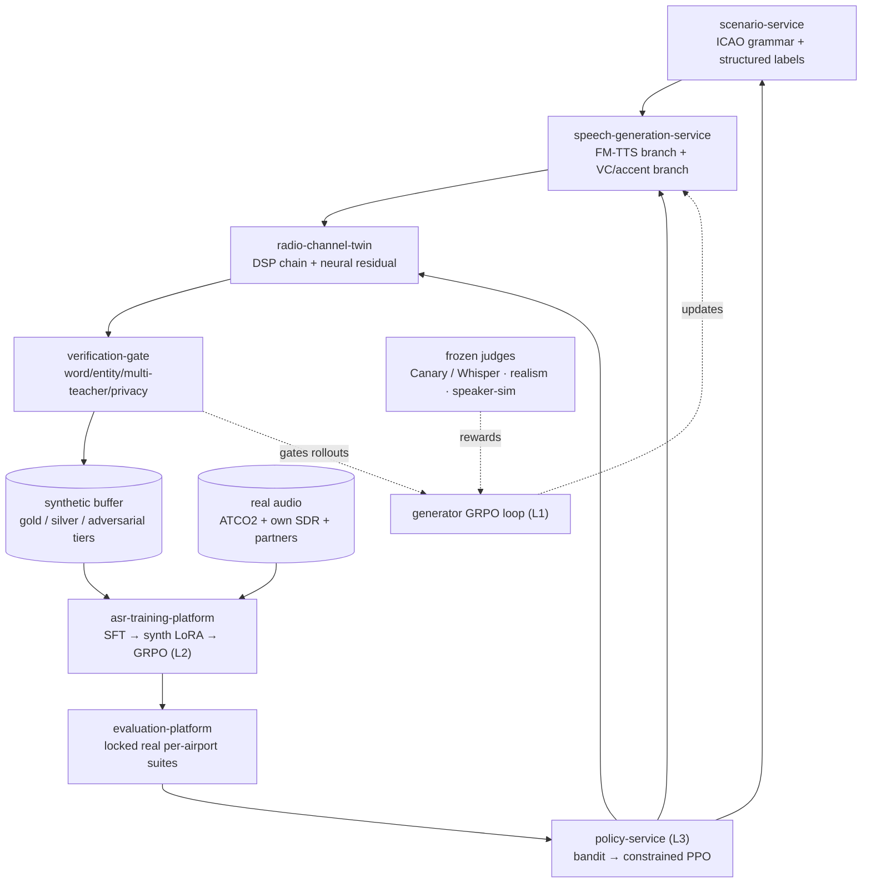

# Synthetic ATC Audio Platform — Engineering Proposal

**Status:** Proposal for design review · August 24, 2026
**Audience:** Implementation team. This document fixes the evidence-backed decisions, invariants, and component requirements. Detailed architecture, parameter selection, and design docs are delegated to the team's research scientist — §12 lists what is reserved for them. Every citation herein was independently re-verified against the literature on the date above; none is speculative.

---

## 1. Objective

Build a closed-loop synthetic-data platform that:

1. generates label-correct, channel-realistic ATC radio audio at scale,
2. trains a streaming ASR to commercial quality using that audio anchored by a small human-transcribed real set per target airport, and
3. continuously steers generation toward the deployed model's measured weaknesses on real traffic.

Reinforcement learning is applied at **three separate points**, each with its own algorithm, reward, and failure mode. Keeping them separate is a design requirement, not a preference — collapsing them into one adversarial loop produces label corruption and reward hacking, both documented in the 2026 literature.

| Loop | Optimizes | Algorithm | Reward source |
|---|---|---|---|
| **L1 — Generator alignment** | The flow-matching speech generator | GRPO on flow models (ODE→SDE) | Frozen judges: intelligibility + entity fidelity + realism + speaker similarity + KL anchor |
| **L2 — Student post-training** | The ASR model itself | GRPO on ASR hypotheses | WER/CER + anti-hallucination / repetition / length penalties |
| **L3 — Data selection** | Which synthetic recipe to generate next | Constrained contextual bandit (PPO only if curriculum sequencing pays) | Δ on real held-out validation slices via proxy utility + periodic counterfactual training runs |

---

## 2. Decisions made

These are settled by evidence and are not open for re-litigation in design review without new results.

| # | Decision | Basis |
|---|---|---|
| D1 | Generator class is **flow matching** (F5-TTS / CosyVoice-3 architecture family). No GAN generators; GAN survives only as a vocoder. | Entire 2025–26 RL-for-audio line is built on FM (Flow-GRPO → F5R-TTS → FlowTTS-GRPO). |
| D2 | Generator RL algorithm is **GRPO with ODE→SDE conversion**, group rollouts, KL-to-reference. | FlowTTS-GRPO fine-tunes the exact open models we'd use, with no value network, preference-pair model, or token-reward model (arXiv:2606.23190). |
| D3 | Generator rewards are **multi-objective weighted composites from frozen scorers**. Single-metric rewards are prohibited. | Single-reward GRPO demonstrably hacks the metric while degrading fidelity (FlowSE-GRPO, ICASSP 2026, arXiv:2601.16483). |
| D4 | The generator's judge ASR is **never** the student ASR, and is architecturally different from it. | Collusion: generator learns audio easy for that model, not realistic audio. |
| D5 | Student-ASR hardness is **not** a generator reward. Hardness lives in L3, bounded by teacher fidelity. | Rewarding the generator for student failure teaches it to garble content ("seven"→mishearable) — label corruption. |
| D6 | Two speech branches, both mandatory: **FM-TTS** (coverage, label purity) and **voice/accent conversion of real clips** (fidelity). | VC preserves prosody/cadence/channel residue TTS smooths away; the ATC study's strongest branch (arXiv:2606.21340). |
| D7 | Channel simulation is a **separate, parameterized DSP twin + small neural residual**, outside the TTS weights. | Auditability + per-airport calibration; acoustic-irregularity realism closes more of the real↔synthetic gap than TTS naturalness (arXiv:2606.29031). |
| D8 | Every sample passes a **word- and entity-level verification gate** before it can train or reward anything. Reject, never auto-relabel. | Word-aligned filtering cut cross-domain WER 13.54%→6.89% and training steps by ~34% (WAVe, Information Sciences 2026). |
| D9 | Student training recipe: **SFT on real → LoRA on synthetic → GRPO on the ASR**. | Recipe validated end-to-end (arXiv:2607.08208); GRPO extracts ~40% more relative WER reduction than SFT from the same synthetic data (arXiv:2607.08409). |
| D10 | Real-data budget: **5–10 h human-transcribed per airport**, not mass transcription. | Mixing 5–10 h real into a large synthetic pool captures most of the achievable gain vs. annotating ~54 h (arXiv:2607.08409). |
| D11 | Release gates run **only on human-transcribed real audio per target airport**, disjoint from everything upstream. Never on synthetic or pseudo-labeled evals. | Standard leakage discipline; representation-level metrics don't predict downstream gains (arXiv:2606.29031). |
| D12 | Data sourcing: **ATCO2 commercial license + our own SDR/receiver collection + partner data. No LiveATC in the training path.** | LiveATC terms are non-commercial and prohibit third-party product use. |
| D13 | No public F5-TTS checkpoints in the product. Architecture is fine (MIT code); public weights are CC-BY-NC (Emilia data). Retrain on cleared data or license alternatives; verify CosyVoice-3 weight license separately from its code license. | License audit. |

---

## 3. System overview

Services to stand up: `scenario-service`, `speech-generation-service`, `radio-channel-twin`, `verification-gate`, `data-control-plane` (manifests, lineage, tiers, replay buffers, split isolation), `policy-service`, `asr-training-platform`, `evaluation-platform`.

---

## 4. Subsystem requirements

### 4.1 scenario-service (text + ground truth)

Purpose: emit ATC transcripts with **structured entity ground truth** — never a flat string.

Requirements:
- Executable ICAO grammar/ontology over: airport, sector, frequency, role, aircraft/airline, callsign, runway, waypoint, instruction type, command value + unit, dialogue state, phraseology standardness, readback correctness, accent/proficiency/rate conditioning, target channel condition.
- An LLM may propose phraseological variation, disfluencies, incorrect readbacks + corrections, confusable simultaneous callsigns, multi-command transmissions, non-native grammatical deviations. A **deterministic validator** must confirm callsign identity, command/value/unit relations, legal ranges (runway, FL, heading, frequency, speed), and controller↔pilot consistency before emission. The LLM never freely invents unvalidated transcripts.
- Emit both display transcript and spoken form (e.g., `BAW462` ↔ "speedbird four six two"), plus the label record consumed by the verification gate and by evaluation.
- Include phonetic respelling augmentation (LLM-generated pronunciation variants injected pre-synthesis) as a generation knob — consistent WER gains across domain datasets (arXiv:2603.16920).

### 4.2 speech-generation-service

**TTS branch.** Flow-matching DiT (F5-TTS/CosyVoice-3 class) with: text/phoneme conditioning; independent speaker, accent, language, role, proficiency embeddings (timbre and accent samplable independently); explicit rate/pitch/energy/duration and disfluency controls; commercial-grade vocoder. Pretrain on a large commercially-cleared multi-accent corpus before ATC adaptation — synthetic-speech scaling results show a thin TTS training distribution caps downstream ASR gains regardless of generation volume (Edinburgh scaling-laws study, 2025).

**VC/accent branch.** Speaker conversion, controllable L1→L2 and L2→L1 accent conversion, rate/prosody conversion, and speaker anonymization applied to real ATC clips. Preserve the source transcript and word alignment; if conversion shifts pronunciation or boundaries beyond verifier limits, the sample is rejected (D8). Coverage KPI is **accent diversity, not speaker count** — the ATC study found accent diversity the more beneficial axis (arXiv:2606.21340).

Reference numbers for the feasibility bar this branch must clear (Whisper-small on ATCO2, arXiv:2606.21340): out-of-the-box ≈ 63.3% WER; real-only fine-tune ≈ 22.7%; **synthetic-only** fine-tune ≈ 24.2%; real + L1→L2 synthetic ≈ 21.6%. Synthetic-only within ~1.5 abs WER of real-only is the published parity target for Phase 2 exit.

### 4.3 radio-channel-twin

Two stages, both versioned and inspectable:

1. **Deterministic DSP chain:** ~300–3,400 Hz bandpass (re-applied after every augmentation step — this ordering mattered in the US-ATC pipeline), resampling/aliasing, AM/VHF artifacts, AGC pumping and DRC, squelch open/close tails, PTT onset/terminal clipping, nonlinear mic/radio distortion, carrier drift, frequency-selective fading, static/impulse/co-channel speech, cockpit and controller-room backgrounds, receiver-specific responses, overlapping/stepped-on transmissions. EBUR128 loudness normalization in preprocessing.
2. **Conditional neural residual** (small FM/diffusion model) trained to add only what the DSP misses, conditioned on airport/region, receiver/antenna, frequency/service, mic class, measured SNR, source side (cockpit vs. room). Per-airport noise banks fit from silence segments.

Operating modes: **reconstruction** (match a measured feed's distribution) and **capped domain randomization** (envelope learned from real recordings — unlimited distortion manufactures mislabeled data).

Rationale to keep in mind during design: the real↔synthetic discriminative signal concentrates in early-to-middle ASR encoder layers and is disrupted most by temporal/prosodic perturbation; convolving synthetic audio with real impulse responses narrows the gap **by reproducing acoustic irregularities, not by improving naturalness** (arXiv:2606.29031). Channel realism budget > TTS polish budget.

### 4.4 verification-gate

Every candidate sample (from either branch, and every L1 rollout) must pass:

1. **Word↔frame alignment** — WAVe-style verifier (open code: github.com/yuriyvnv/WAVe); non-monotonic learned alignment scoring each word against audio frames.
2. **Multi-teacher consensus** — agreement across architecturally diverse frozen teachers (Canary-class + Whisper + a transducer). The published coarse filter (discard at >50% teacher WER, which cut ~35% of accent-converted samples) is the floor; we gate at word/entity level.
3. **Entity fidelity** — exact match on normalized callsign, runway, heading, altitude/FL, frequency, speed; forced-alignment/phoneme-posterior check on critical tokens.
4. **Audio validity** — no silence collapse, clipping, repeated segments, generator hallucinations.
5. **Domain plausibility** — real-vs-synthetic classifier score + channel-parameter plausibility.
6. **Privacy** — speaker-similarity threshold on transformed real recordings (anonymization audit).
7. **Coverage value** — sample fills an underrepresented bucket rather than a saturated one.

Output tiers: **gold** (all words + entities verified) / **silver** (transcript verified, lower realism) / **adversarial** (hard-but-valid, capped ≤5% of any training mix) / **rejected** (any semantic ambiguity or entity mismatch). Per-artifact lineage record: generator/scenario/channel versions, seed, conditioning sources, exact channel parameters, teacher hypotheses + scores, tier + rejection reasons, and every training run that consumed it.

### 4.5 L1 — Generator GRPO loop (implementation spec)

1. **Stochastic rollouts:** convert the FM sampling ODE to a marginal-preserving SDE (Flow-GRPO construction, arXiv:2505.05470) and sample **G rollouts per conditioning input**. Do not ship rollout=1 — group-relative advantage is the mechanism (the rollout=1 predecessor left group advantages and multi-objective optimization on the table).
2. **Denoising reduction:** fewer integration steps for training rollouts than inference; full steps for eval only.
3. **Advantage:** per-group reward normalization (subtract mean, divide by std).
4. **Update:** PPO-style clipped importance-weighted objective over SDE trajectory log-probs + **KL penalty to the frozen reference generator**. The frozen reference is also the drift/reward-hacking detector — keep it deployed as a comparison endpoint.
5. **Drop CFG during RL training**; re-enable for inference (accelerates convergence — FlowTTS-GRPO).
6. **Weight surface:** apply RL to the FM component (improves audio-detail metrics); LoRA/adapters before full weights; content/semantic conditioning pathways frozen so RL cannot improve rewards by changing *what is said*.
7. **Throughput:** reward growth scales with samples-seen-per-update; scale rollout parallelism before touching optimizer settings.
8. **Prompt mix:** include hard cases (rare entities, high rate, dense numerics) — improves robustness and is fed by L3.
9. **Warm start:** run offline preference optimization first (DPO/intelligibility-preference pairs ranked on transcript fidelity, entity fidelity, naturalness, accent credibility, radio realism — INTP, ACL 2025). Online GRPO second. If a *waveform-diffusion* generator is ever in scope instead of FM: naive RWR/DDPO are unstable there; anchor with the original diffusion loss + KL (DLPO, arXiv:2405.14632).

**Reward (weighted composite, all scorers frozen):**

`R_G = w_f·(−WER_judge − NLL_judge) + w_e·EntityExact + w_r·Realism + w_s·SpeakerSim + w_q·Quality − λ·KL(π_G ‖ π_ref) − ρ·ArtifactPenalty`

- *Transcript fidelity:* judge-ASR WER/CER on the rollout + judge NLL of the ground-truth transcript. Judge = frozen Canary-1B-v2 or Whisper-large-v3 (architecturally distinct from the student, per D4).
- *Entity fidelity:* exact normalized match on safety-critical entities extracted from the judge hypothesis. Weight entities above raw WER — one garbled digit outweighs five garbled filler words.
- *Realism:* embedding distance to real ATC audio and/or real-vs-synth discriminator score (the discriminator lives in the reward, not the generator graph).
- *Speaker/accent similarity:* embedding cosine to conditioning reference (VC/cloning branches).
- *Quality:* DNSMOS/P.835-class predictor.
- Rollouts failing the §4.4 gate: large fixed negative reward or exclusion from the group.
- Minimum two orthogonal reward families active at all times (fidelity + realism) per D3. Weighted combination converged faster than probabilistic reward selection in FlowTTS-GRPO; if weight tuning proves brittle, the fallback is vector-valued rewards with group-wise Pareto non-dominated selection + advantage masking (Flow-Multi pattern).

### 4.6 L2 — asr-training-platform

**Pipeline:** full SFT on real/labeled → LoRA fine-tune on gold synthetic → **GRPO on the ASR** with reward = −WER/CER of temperature-sampled hypothesis groups, plus penalties for hallucination, repetition, and length deviation (both penalties from day one — ASR GRPO without them drifts to degenerate outputs). KL to the SFT checkpoint. Validated end-to-end at MLC-SLM 2026 (arXiv:2607.08208: SFT largest gain; synth-LoRA and GRPO add robustness). In synthetic-dominant regimes, expect GRPO to extract ~40% more relative WER reduction than SFT from identical synthetic data (arXiv:2607.08409).

**Models:**
- *Streaming production student:* FastConformer + TDT/RNN-T (Parakeet-TDT-0.6B-v3 class: ≈6.3% avg English WER, RTFx ≈3,300, 600M params — arXiv:2509.14128), auxiliary CTC head, entity-boundary tokens (TokenVerse pattern), role/intent/confidence heads, ADS-B/flight-plan contextual biasing, streaming-chunk training.
- *Offline teacher/judge pool:* Canary-1B-v2 class (beats Whisper-large-v3 on English at ~10× speed) + Whisper + one transducer; ATC LM rescoring; forced aligner.

**Gap-reduction modules (layer in as ablations justify):** R2S gradient-reversal domain classifier on the encoder (real/synth indistinguishability); SYN2REAL task-vector arithmetic (~10% avg WER gain in its published setting); consistency training across multiple channel renderings of the same utterance; BEARD-style BEST-RQ encoder adaptation if we accumulate thousands of untranscribed in-domain hours (~12% relative over plain FT with ~5,000 h unlabeled, arXiv:2510.24570).

**Mixture (starting point, tuned per slice):** 70–80% real/strongly-verified pseudo-labeled · 20–30% gold synthetic · ≤5% adversarial tier. (The published 50/50 reflected a 4 h real set — not a production ratio.) Maintain a replay buffer of high-utility real examples; end every cycle with real-only calibration before checkpoint selection.

**Whisper-specific warning:** HuggingFace PEFT LoRA is structurally incompatible with Whisper's log-mel encoder (documented in the US-ATC pipeline preprint) — plan for conservative full fine-tuning or a custom adapter insertion if Whisper is in the model pool.

### 4.7 L3 — policy-service (data-recipe controller)

**Action space:** (scenario class, accent, speaker/voice, rate, generator branch, SNR, channel condition, interference, entity type, difficulty tier).
**Observation:** per-slice error rates (airport, accent, channel, role, command, entity), training-set coverage, calibration/rejection rates, real↔synth representation distance, recent marginal utility of generated buckets, student–teacher disagreement, generation + training compute cost, curriculum stage.

**Algorithm:** constrained contextual bandit (Thompson sampling / LinUCB / neural bandit) first — most generation decisions are single-step, and PPO adds variance without value until *sequencing* matters. Promote to constrained PPO only if the curriculum (native → accented → mild degradation → severe-but-intelligible → rare entities/overlaps) shows measurable sequencing gains in counterfactual runs.

**Hardness window (the safe form of hard-case mining):** keep samples with `WER_teacher < τ₁` (label trustworthy) and `τ₂ < WER_student < τ₃` (challenging, not hopeless).

**Reward:** measured only on untouched real validation slices — `R = w_c·ΔCommandAcc + w_e·ΔEntityF1 + w_cs·ΔCallsignAcc − w_w·ΔWER − w_cal·ΔECE + λ·Coverage − μ·InvalidRate − ν·Cost`. WER must not dominate: command accuracy and WER decouple in ATC, and a single wrong number is operationally serious (Helmke et al., 2021).

**Making it computable:** per-action retraining is impossible. Use proxy utility (per-sample gradient alignment with a real validation minibatch, TracIn/influence estimates, student loss/uncertainty/entropy, teacher disagreement, representation novelty, entity-specific error contribution), then **scheduled counterfactual runs**: identical frozen init, train with vs. without the candidate bucket, evaluate on the same locked real suite, recalibrate the proxy. This is explicitly bilevel — controller φ shapes D_synth(φ); student θ*(φ) trains on the mixture; φ is scored on real-validation loss of θ*(φ).

**v2 research track:** Dataset Policy Gradient (arXiv:2604.08423) replaces proxies with exact data attribution via higher-order gradients, provably approximating the true bilevel gradient — demonstrated on language models only, and expensive. Prototype on a small student after the bandit loop ships; not on the critical path.

### 4.8 evaluation-platform

Three physically separated real-audio sets per airport: **reward-validation** (L3 uses this), **model-selection**, **locked final test** (touched only at release). None may enter generator training, channel-model fitting, teacher fine-tuning, RL rewards, filtering thresholds, or hyperparameter search.

**Split design:** disjoint by airport/region, time period, receiver/frequency, estimated speaker, callsign (with explicit unseen-callsign evaluation — reuse ATCCaps' seen/unseen design; its 202.94 h / 170,385 utterances / 922 normalized callsigns built from ATCO2 with ADS-B metadata is the schema reference, arXiv:2606.22399), accent region, channel severity. Random utterance splits leak via adjacent transmissions and repeated callsigns — prohibited.

**Metric panel:** WER + S/D/I; callsign accuracy (seen/unseen, FP/miss); command/intent accuracy and slot F1; exact accuracy on altitude/heading/runway/speed/frequency/waypoint; critical-number substitution rate; ECE/Brier/selective-risk; per-slice robustness (airport, accent, SNR, interference, receiver); first-token/endpoint latency, RTF, memory; drift by period/location/equipment/new callsigns; real-vs-synth classifier accuracy as a tracked (not gating) trend.

**Release rule:** ship only on improvement-or-parity across the entity/safety panel with statistical significance on safety-critical entities, plus latency budgets. Never on aggregate WER alone.

**External reference points for target-setting:** WhisperATC (open SOTA on European corpora): 3.88% WER ATCOSIM speaker-split, ~13.5% ATCO2, degrading to **30.3% on American ATC** — the accent/phraseology gap is the product opportunity. Domain-matched preprocessing + 5-fold augmentation on 55 US clips recovered a 54.8% relative reduction (Research Square rs-8970162) — small real anchors go far when the channel model matches.

---

## 5. System invariants (violations block merge/release)

1. Judge ASR ≠ student ASR; judges frozen and architecturally distinct (D4).
2. ≥2 orthogonal reward families on any RL'd generator; no single-metric rewards (D3).
3. Student-hardness signals never reach the generator objective; hardness bounded by `WER_teacher < τ₁` in L3 (D5).
4. KL-to-frozen-reference on every RL'd generator; reference retained for drift detection.
5. No sample trains or rewards anything without passing the verification gate; failed transformations are rejected, never relabeled (D8).
6. Adversarial tier ≤5% of any mix; real replay buffer always active.
7. Reward-validation / model-selection / final-test real sets mutually disjoint and disjoint from all upstream fitting (D11).
8. Real-vs-synth classifier accuracy is monitored continuously but is not a release gate — release gates are real-audio task metrics only.
9. No LiveATC audio in any commercial training or fine-tuning path (D12); no CC-BY-NC checkpoints in the product (D13).
10. Every dataset/model/checkpoint carries a lineage + license record before first use.

---

## 6. Data sourcing & licensing

- **ATCO2 (ELRA/ELDA):** 4 h gold-transcribed test corpus (word-level + callsign/command/value NER + speaker role) and ~5,281 h pseudo-labeled audio with SNR/language-detection metadata and callsign-boosting context (arXiv:2211.04054). Full corpus is commercially licensable (one purchaser publicly reported ≈$6.6k for full access); counsel to confirm derivative-model rights, redistribution limits, and generated-data provisions before purchase.
- **Own SDR/receiver collection** at target airports (subject to local recording law): the LiveATC-free path to per-feed channel statistics, silence-segment noise banks, and untranscribed hours for BEARD-style encoder adaptation. Pair with **5–10 h human transcription per airport** (D10).
- **Auxiliary corpora:** ATCOSIM, UWB-ATCC; ATCCaps schema for callsign supervision; partner/airline data where obtainable.
- **Registry fields per asset:** source + acquisition method, license version + agreement, commercial/derivative rights, consent/privacy basis, geographic restrictions, retention/deletion, checkpoint lineage, and whether synthetic outputs may train further models. Permissive code ≠ permissive weights — audit both.

---

## 7. Delivery phases & exit criteria

**P1 — Baselines + eval harness.** License data; build split tooling and the §4.8 metric panel; reproduce Canary/Parakeet/Whisper/WhisperATC baselines; lock the three real suites per airport.
*Exit:* baseline numbers reproduced; leakage audit of splits passes; latency/compute baselines recorded.

**P2 — Deterministic synthetic system.** Scenario grammar + labels; cleared FM-TTS; VC/accent conversion; DSP channel twin; verification gate; per-branch ablations.
*Exit:* synthetic-only fine-tune within ~1.5 abs WER of real-only on the internal ATCO2-style benchmark (published parity bar); gate rejection reasons dashboarded.

**P3 — Gap reduction.** Neural channel residual; R2S adversarial term; cross-rendering consistency training; mixture tuning per slice; real-only calibration step; real-vs-synth classifier dashboard live.
*Exit:* real+synthetic mixture beats real-only on target slices; classifier accuracy trending down without task-metric regression.

**P4 — RL, in validated-ROI order.** (a) L2 ASR-GRPO; (b) L1 generator GRPO (DPO warm-start first); (c) L3 bandit with proxy utility + counterfactual recalibration; PPO curriculum only if sequencing pays.
*Exit:* (a) GRPO checkpoint beats SFT-only on real validation; (b) generator improves judge-fidelity + realism jointly with bounded KL; (c) bandit beats uniform sampling in counterfactual runs.

**P5 — Human preference alignment.** Trained ATC reviewers rank paired samples (intelligibility, accent credibility, channel authenticity, phraseology); fold into generator preference data; accent-stereotyping review per region.
*Exit:* reviewer-preference win-rate over the pre-alignment generator; no per-region accent regressions.

**P6 — Shadow deployment.** Non-operational shadow mode; failure-slice collection feeding L3 (never the locked test set); drift/calibration/latency monitoring; instant rollback to previous production model.
*Exit:* release-gate panel green on locked suites; rollback drill passed.

---

## 8. Risks & mitigations

| Risk | Failure mode | Mitigation (built into design) |
|---|---|---|
| Reward hacking (L1) | Generator gains on one metric while fidelity degrades | D3 multi-metric rewards; KL anchor; gate on rollouts; frozen-reference comparisons |
| Judge–generator collusion | Audio easy for the judge, unrealistic in the field | D4 judge≠student, architecturally distinct, frozen |
| Label corruption via hardness | Generator garbles content to fail the student | D5: hardness only in L3, `WER_teacher < τ₁` |
| TTS-fingerprint overfitting | Student learns vocoder artifacts, not speech | Multiple generators; R2S; consistency training; classifier trend monitoring |
| Semantic label drift in VC | Callsign/number changes during conversion | Word/entity gate; reject-don't-relabel |
| Evaluation leakage | RL optimizes toward the test set | Three disjoint real suites; shadow failures feed L3 only |
| Model/mode collapse | Synthetic distribution narrows on current weaknesses | Coverage reward; entropy/novelty; real replay; adversarial cap |
| Accent stereotyping | Exaggerated or inaccurate L2 speech | Reviewer panels per region (P5); bounded conditioning; per-region eval slices |
| Licensing contamination | Non-commercial weights/audio in the product | D12/D13; asset registry; counsel review at P1 |
| Privacy leakage in VC | Converted audio retains identifiable voice | Speaker-similarity threshold in gate; anonymization audit |

---

## 9. Reserved for the research scientist

Settled *that*, not *how much*. Parameter selection and detailed design for:

- Group size G, SDE noise schedule, rollout denoising step count, clip range, KL coefficient λ, and the reward weights `w_f, w_e, w_r, w_s, w_q` (plus whether to switch to Pareto/advantage-masking if weighted sums prove brittle).
- Judge/teacher ensemble composition and consensus thresholds; forced-aligner choice.
- Hardness thresholds τ₁, τ₂, τ₃ and their annealing schedule.
- DPO warm-start pair volume and pairing criteria before L1 goes online.
- Mixture-ratio schedule per slice and phase; replay-buffer sizing.
- Channel-residual model capacity, conditioning granularity, and the domain-randomization envelope caps.
- Speaker-anonymization similarity threshold and privacy audit protocol.
- Proxy-utility estimator choice (gradient-alignment vs. TracIn vs. hybrid) and counterfactual-run cadence/budget.
- Whether/when the PPO curriculum earns its variance over the bandit; DPG prototype scope (small student, offline).
- Calibration targets (ECE/selective-risk) and rejection-policy thresholds per entity class.
- Streaming chunking/latency budget trade-offs on the Parakeet-class student.

---

## Appendix A — Verified reference index

All entries independently confirmed against the primary source, Aug 24, 2026.

| Role in this proposal | Reference | Link |
|---|---|---|
| ODE→SDE online RL for flow models; denoising reduction | Flow-GRPO | arxiv.org/abs/2505.05470 |
| First GRPO on FM-TTS (dual ASR+similarity reward; ~29.5% rel WER↓; rollout=1 limitation) | F5R-TTS | arxiv.org/abs/2504.02407 · github.com/FrontierLabs/F5R-TTS |
| L1 algorithm source: GRPO on F5-TTS/CosyVoice 3.0; drop-CFG; weighted rewards; hard cases; throughput scaling | FlowTTS-GRPO | arxiv.org/abs/2606.23190 |
| Single-metric reward hacking + multi-metric fix (speech, ICASSP 2026) | FlowSE-GRPO | arxiv.org/abs/2601.16483 |
| Multi-objective GRPO stability fallback (Pareto + advantage masking; from T2I) | Flow-Multi | PMC 12943997 |
| GRPO on LLM-TTS backbone; gains compound with FM decoder | Multi-Reward GRPO TTS | arxiv.org/abs/2511.21270 |
| ATC synthetic pipeline + feasibility numbers; accent>speaker diversity; ~35% discard rate | Bagat et al. | arxiv.org/abs/2606.21340 |
| Callsign dataset schema + seen/unseen split design | ATCCaps | arxiv.org/abs/2606.22399 |
| Word-aligned synthetic verification (13.54→6.89% WER; −34% steps) | WAVe, Information Sciences 2026 | github.com/yuriyvnv/WAVe |
| Encoder adaptation on ~5,000 h unlabeled ATC (+~12% rel) | BEARD | arxiv.org/abs/2510.24570 |
| Closed-loop ASR↔TTS self-refinement pattern (20–50% error↓) | Twister | arxiv.org/abs/2506.11130 |
| Gap anatomy: early-mid layers; RIR/irregularity finding; separability ≠ downstream | Labrak et al. | arxiv.org/abs/2606.29031 |
| L2 recipe: SFT → synth LoRA → GRPO + anti-hallucination penalties | MLC-SLM 2026 system | arxiv.org/abs/2607.08208 |
| GRPO ≈40% rel over SFT on synthetic-only; 5–10 h real anchor | "Better Call GRPO" | arxiv.org/abs/2607.08409 |
| v2 bilevel data optimization (LM-only so far) | Dataset Policy Gradient | arxiv.org/abs/2604.08423 |
| Generation-quality optimization drives downstream gains | Boulianne | arxiv.org/abs/2508.21631 |
| Teacher (Canary-1B-v2) and student (Parakeet-TDT-0.6B-v3) model classes + numbers | NVIDIA | arxiv.org/abs/2509.14128 |
| Open ATC SOTA + 30.3% US-accent gap | WhisperATC | github.com/jlvdoorn/WhisperATC |
| US channel-matched fine-tuning recipe; PEFT-LoRA × Whisper encoder incompatibility (preprint) | Research Square rs-8970162 | researchsquare.com/article/rs-8970162/v1 |
| Waveform-diffusion RL stability (if FM is abandoned) | DLPO | arxiv.org/abs/2405.14632 |
| Intelligibility preference alignment for TTS (DPO warm start) | INTP, ACL 2025 | aclanthology.org/2025.acl-long.598 |
| Task-vector synth-to-real mitigation (~10% avg WER↓) | SYN2REAL | arxiv.org/abs/2406.02925 |
| Gradient-reversal real/synth encoder alignment | R2S, Interspeech 2025 | isca-archive.org/interspeech_2025/tran25_interspeech.html |
| Pre-synthesis pronunciation variability | PRA | arxiv.org/abs/2603.16920 |
| Hard-sample synthesis prior art | Hard-Synth | arxiv.org/abs/2411.13159 |
| Corpus + commercial licensing; 4 h gold + 5,281 h pseudo-labeled | ATCO2 | arxiv.org/abs/2211.04054 · atco2.org/data |
| Why entity metrics gate releases, not WER | Helmke et al., 2021 | elib.dlr.de/145465 |
